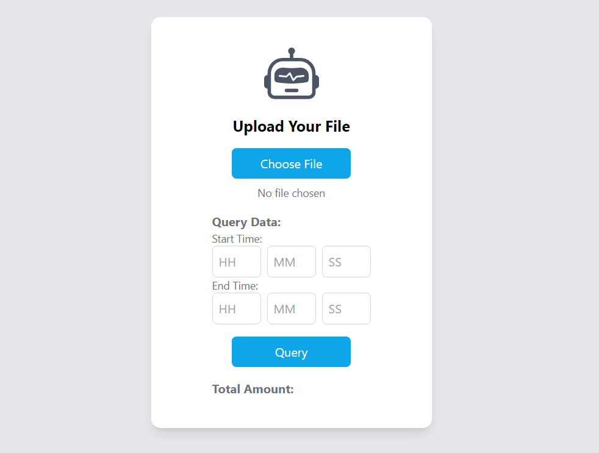
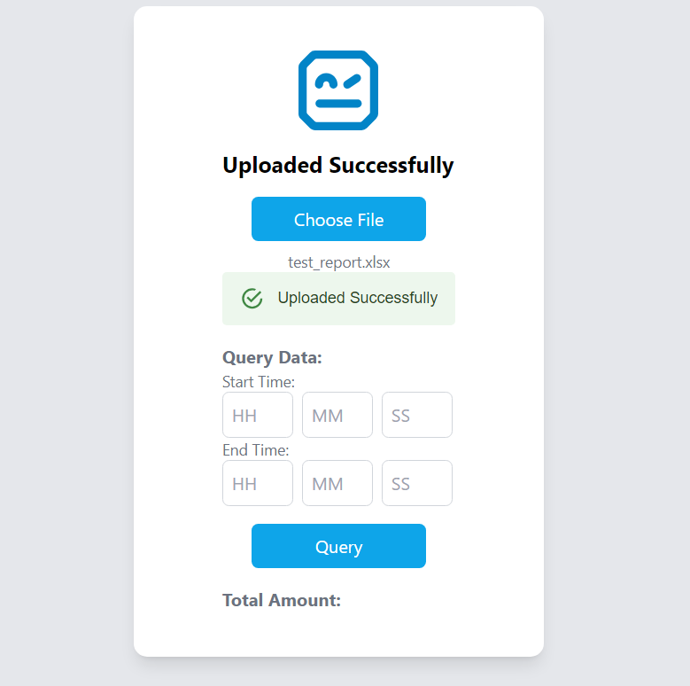
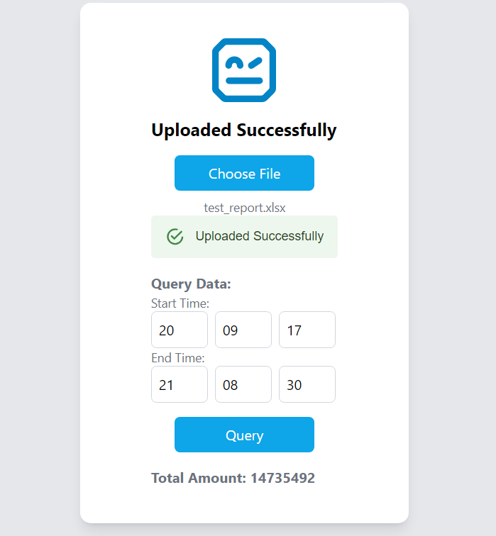

## Getting Started
First, run api from backend:

```bash
cd Task_01/backend
```
```bash
uvicorn fastAPI:app --reload
```
You can check api at:
```bash
http://127.0.0.1:8000/docs
```

Next, run frontend:

```bash
cd Task_01/frontend
```
```bash
npm run dev
```

You can view result at:
```bash
http://localhost:3000/
```

### Illustration
<div style="display: flex; justify-content: space-around;">
    
    
    
</div>
