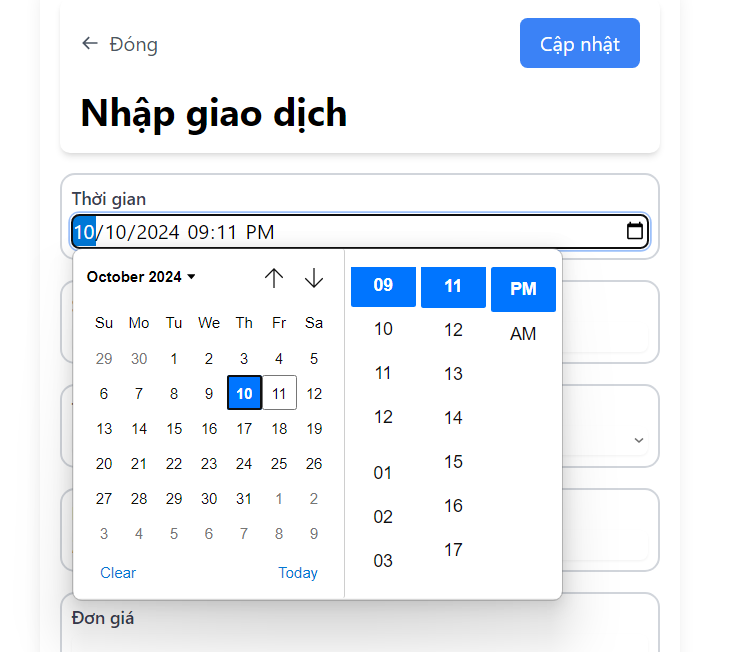
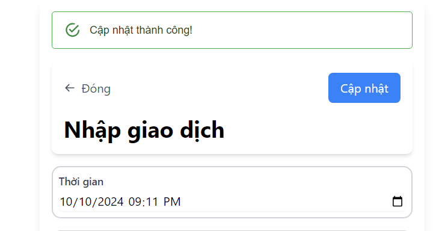

First, run the development server:

```bash
npm run dev
```

Open [http://localhost:3000](http://localhost:3000) with your browser to see the result.

### Illustration

We can choose date by clicking on the date input:



When we fill error input, we will see:


When we click on the update button, we will see:



When we click on the close button, we will see:


And we can click again to open it:
